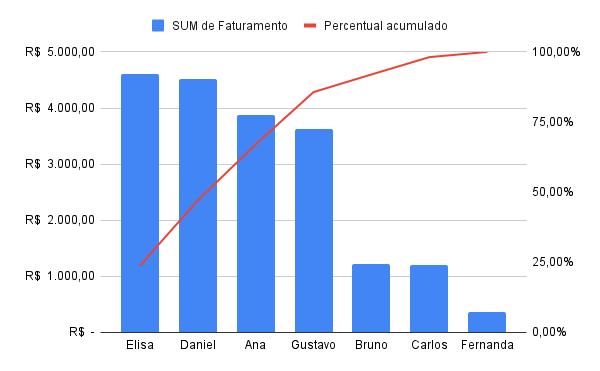

# analise-pareto-vendas
Análise de Pareto | Faturamento por Cliente
Projeto de análise exploratória com foco em identificar a concentração de faturamento por cliente, aplicando o Princípio de Pareto (80/20).

Objetivo: 
Identificar quais clientes são responsáveis pela maior parcela da receita total, avaliando o nível de concentração do faturamento e possíveis riscos de dependência comercial.

Tecnologias utilizadas:
- Google BigQuery (SQL);
- Window Functions (SQL): SUM() e OVER();
- Google Sheets (visualização);
- GitHub (documentação do projeto).

Metodologia:
- Cálculo do faturamento por cliente;
- Ordenação decrescente por receita;
- Cálculo do faturamento acumulado (Window Function);
- Cálculo do percentual acumulado (%);
- Construção do gráfico de Pareto no Google Sheets.

Resultado:
A análise demonstrou que aproximadamente 80% da receita está concentrada em um grupo reduzido de clientes, evidenciando um cenário de alta concentração de faturamento.

Insights:
- Forte dependência de poucos clientes;
- Potencial risco financeiro em caso de churn;
- Oportunidade de diversificação da base;
- Possível priorização estratégica dos clientes mais relevantes.

Aprendizados  Técnicos:
- Aplicação prática de Windoe Functions;
- Cálculo de métricas acumuladas;
- Construção de análise de concentração;
- Integração entre SQL e visualização externa.

Query principal:
  ```
  WITH faturamento_cliente AS ( 
    SELECT 
      cliente, 
      SUM(quantidade * preco_unit) AS faturamento
  FROM prefab-fabric-462023-n0.estudos_sql.vendas 
  GROUP BY cliente
  ),
  
  ranking AS (
    SELECT
      cliente,
      faturamento,
      SUM(faturamento) OVER() AS faturamento_total,
      SUM(faturamento) OVER(ORDER BY faturamento DESC) AS faturamento_acumulado
    FROM faturamento_cliente
  )
  
  SELECT
    cliente,
    faturamento,
    faturamento_acumulado,
    ROUND(
      (faturamento_acumulado / faturamento_total) * 100,2
      ) AS percentual_acumulado
  FROM ranking
  ORDER BY faturamento DESC;
```
## Visualização do Dashboard



Dashboard interativo:
[Google Sheets](https://docs.google.com/spreadsheets/d/1rWbaohZBzy_2T3wD9Fjx3mnWA6TN_zzDHfN8I_y8YlY/edit?usp=sharing)
